# Component Structure

```mermaid
flowchart TD
    AppLayout[App Layout] --> Navbar[Navbar]
    AppLayout --> PageContent[Page Content]
    AppLayout --> Footer[Footer]
    AppLayout --> CartDrawer[CartDrawer]

    PageContent --> Hero[Hero]
    PageContent --> FeaturedProducts[FeaturedProducts]
    PageContent --> Categories[Categories]
    PageContent --> Benefits[Benefits]
    PageContent --> Testimonials[Testimonials]
    PageContent --> CTA[CTA]

    ProductCatalog[Product Catalog] --> ProductGrid[ProductGrid]
    ProductGrid --> ProductCard[ProductCard]
    ProductCatalog --> ProductFilters[ProductFilters]

    ProductDetail[Product Detail] --> ProductGallery[ProductGallery]
    ProductDetail --> ProductDetails[ProductDetails]
    ProductDetail --> QuantitySelector[QuantitySelector]

    CartPage[Cart Page] --> CartItem[CartItem]
    CartPage --> CartSummary[CartSummary]
    CartPage --> EmptyCart[EmptyCart]

    CheckoutPage[Checkout Page] --> CheckoutForm[CheckoutForm]
    CheckoutForm --> ShippingForm[ShippingForm]
    CheckoutForm --> PaymentMethod[PaymentMethod]
    CheckoutForm --> OrderSummary[OrderSummary]

    SharedUI[Shared UI] --> Button[Button]
    SharedUI --> Card[Card]
    SharedUI --> Badge[Badge]
    SharedUI --> Section[Section]
    SharedUI --> Input[Input]
    SharedUI --> Select[Select]
    SharedUI --> Separator[Separator]
```

## Explanation

Components are organized by responsibility. Layout components wrap every page. Section components compose the homepage. Product, cart, and checkout folders contain domain-specific UI. Shared primitives in `components/ui/` provide consistent styling across the storefront.
