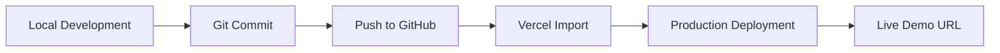

# Deployment

**Live Demo:** https://premium-e-commerce-store-ten.vercel.app/

## Deployment Steps

1. Build locally with `pnpm build`.
2. Push the repository to GitHub at `Valakasneckle/04-premium-ecommerce`.
3. Import the repository into Vercel.
4. Deploy with default Next.js settings (no custom build command required).
5. Copy the production URL.
6. Add the live URL to `README.md` and `.env.example`.
7. Add the live URL to the GitHub repository About section.
8. Add the live URL to your portfolio hub and LinkedIn post.

## Environment Variables

| Variable | Purpose |
|---|---|
| `NEXT_PUBLIC_SITE_URL` | Public site URL for metadata and links |

Copy `.env.example` to `.env.local` for local development if needed.
