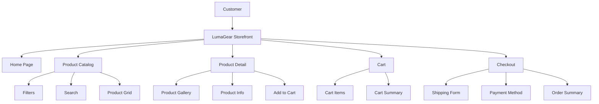

# System Overview

## Explanation

The LumaGear storefront is a client-side e-commerce experience built with Next.js. Shoppers enter through the homepage, browse the product catalog with filters and search, open product detail pages to review items, add products to a Zustand-managed cart, and complete a mock checkout flow. All product data is served from static TypeScript files, making the architecture easy to deploy and extend with a backend later.
