# User Flow

```mermaid
flowchart LR
    A[Customer lands on homepage] --> B[Browse featured products]
    B --> C[Open product catalog]
    C --> D[Use filters or search]
    D --> E[Open product detail page]
    E --> F[Add product to cart]
    F --> G[Review cart]
    G --> H[Open checkout]
    H --> I[Enter shipping and payment details]
    I --> J[Place mock order]
```

## Explanation

The shopping flow is designed to minimize friction. Shoppers can enter from the homepage or catalog, refine results with filters, inspect product details, add items to a persistent cart, review totals on the cart page or drawer, and complete a guided checkout experience. The confirmation step provides immediate feedback with order details and next actions.
